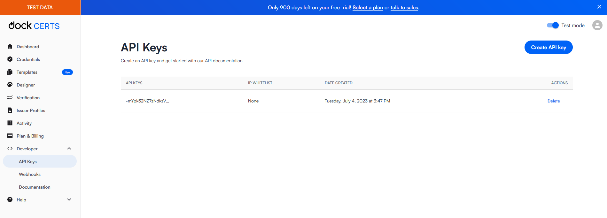

# Issuing Credentials: Quick Start

Issuing a Polygon ID verifiable credential via the Dock REST API is fairly straightforward. There are four
primary steps:

1. Get an API key from Dock Certs
1. Create a Polygon ID issuer profile
1. Create a credential claim request
1. Share the claim QR code link with the recipient

We go into each of these steps in more detail below.

## 1. Get an API key from Dock Certs

1. Sign up for a free trial at https://certs.dock.io
1. Expand the `Developer` section on the left navigation panel
1. Click the `Create API key` button
1. Copy the `API key`
1. Update the `DOCK_API_TOKEN` value in your `.env` file



## 2. Create a Polygon ID issuer profile
In order to issue Polygon ID credentials the issuer must be a Polygon ID DID (i.e. `did:polygonid`). The Dock platform also supports adding more profile information related to the DID (e.g. name, description, logo). Adding the profile details is an optional second step.

### Create the DID
DIDs are managed on the Dock platform using the `/dids` route. All `did:polygonid` DIDs are identified using the `type:'polygonid'` attribute and use an encryption key of type `bjj`.

> **NOTE**
> The same issuer profile can be used for multiple credentials so in most cases you will only need to perform this step once.

Example axios call:
```javascript
  const axiosHeaders = {
    headers: {
      'DOCK-API-TOKEN': process.env.DOCK_API_TOKEN,
    },
  };

  const polygonDidBody = {
    keyType: 'bjj',
    type: 'polygonid'
  };

  const didResp = await axios.post(`${baseUrl}/dids`, polygonDidBody, axiosHeaders);

```

This will return a response that looks like:
```javascript
{
  did: 'did:polygonid:polygon:mumbai:2qFuT3DDK6M7k8hYozPZMd8ouN8nY2sJ8Fivriw5YQ',
  controller: 'did:polygonid:polygon:mumbai:2qFuT3DDK6M7k8hYozPZMd8ouN8nY2sJ8Fivriw5YQ',
  id: '',
  data: {
    did: 'did:polygonid:polygon:mumbai:2qFuT3DDK6M7k8hYozPZMd8ouN8nY2sJ8Fivriw5YQ',
    controller: 'did:polygonid:polygon:mumbai:2qFuT3DDK6M7k8hYozPZMd8ouN8nY2sJ8Fivriw5YQ'
  }
}
```
More details can be found in the [DIDs](https://docs.api.dock.io/#dids) section of the API docs.

### Create a Profile (optional)
Adding profile details for the DID to the Dock platform is simple and can be added using the `/profiles` route.

Example axios call:
```javascript
  const reqBody = {
    "name": "My Test Polygon ID DID",
    "did": "did:polygonid:polygon:mumbai:2qFuT3DDK6M7k8hYozPZMd8ouN8nY2sJ8Fivriw5YQ",
    "description": "Testing out the Issuer Profiles api"
  };

  const profileResp = await axios.post(`${baseUrl}/profiles`, reqBody, axiosHeaders);
```

This will return a response that looks like:
```javascript
{
  did: "did:polygonid:polygon:mumbai:2qFuT3DDK6M7k8hYozPZMd8ouN8nY2sJ8Fivriw5YQ",
  name: "My Test Polygon ID DID",
  description: "Testing out the Issuer Profiles api",
  type: "polygonid"
}
```
More details can be found in the [Profiles](https://docs.api.dock.io/#profiles) section of the API docs.

## 3. Create a credential claim request
When issuing a credential we actually set up a claim request because we need to ask the recipient for their DID before we can issue them the credential.
They will provide the DID from their Polygon ID wallet when they scan the QR code in the following section.

> **Note**
>
> In the examples we've hard-coded a specific credential schema (the KYCAgeCredential schema). You can find other sample schemas on the [Iden3 Github repo](https://github.com/iden3/claim-schema-vocab/tree/main/schemas/json). NOTE: make sure you grab the `raw` version of the file.
>
>Custom schemas are also supported. You can do this three different ways:
> * link to a publicly hosted schema directly
> * create a custom schema using the [Templates](https://certs.dock/io/schemas) feature on Dock Certs
> * use the [Credential Schemas](https://docs.api.dock.io/#credential-schemas) routes in the API

Example axios call:
```javascript
  const requestBody = {
    schema: 'https://raw.githubusercontent.com/iden3/claim-schema-vocab/main/schemas/json/KYCAgeCredential-v2.json',
    claims: [ 'id' ],
    credentialOptions: {
      anchor: false,
      persist: false,
      emailMessage: '',
      credential: {
        schema: 'https://raw.githubusercontent.com/iden3/claim-schema-vocab/main/schemas/json/KYCAgeCredential-v2.json',
        issuer: 'did:polygonid:polygon:mumbai:2qFuT3DDK6M7k8hYozPZMd8ouN8nY2sJ8Fivriw5YQ',
        name: 'KYCAgeCredential',
        type: [ "VerifiableCredential", "KYCAgeCredential" ],
        subject: {
          birthday: 20230928,
          documentType: 3324
        }
      },
      distribute: true
    }
  };

  const credentialResponse = await axios.post(`${baseUrl}/credentials/request-claims`, requestBody, axiosHeaders);
```

This will return a response that looks like:
```javascript
{
  "id": "c3066752-43bb-40b6-b904-df5eff1f571b",
  "qrUrl": "https://creds-testnet.dock.io/claim/c3066752-43bb-40b6-b904-df5eff1f571b?protocol=iden3comm&n=281baf57-fb6b-492a-b74f-f86afa36ab97",
  "created": "2023-07-15T00:04:59.724Z",
  "updated": "2023-07-15T00:04:59.724Z",
  "singleUse": true,
  "claimMap": {
    "id": "id"
  },
  "issuer": "did:polygonid:polygon:mumbai:2qDSnLGMEvR3yJ7Ts7SrG7UasKQfjUfL7aL2SivGb6",
  "protocol": "iden3comm",
  "credentialOptions": {
    "anchor": false,
    "persist": false,
    "credential": {
      "name": "KYCAgeCredential",
      "type": [
        "VerifiableCredential",
        "KYCAgeCredential"
      ],
      "issuer": "did:polygonid:polygon:mumbai:2qDSnLGMEvR3yJ7Ts7SrG7UasKQfjUfL7aL2SivGb6",
      "schema": "https://raw.githubusercontent.com/iden3/claim-schema-vocab/main/schemas/json/KYCAgeCredential-v2.json",
      "subject": {
        "birthday": 1687752000,
        "documentType": 3324
      }
    },
    "distribute": true,
    "emailMessage": ""
  }
}
```
More details can be found in the [Credentials](https://docs.api.dock.io/#issue-credentials) section of the API docs.

## 4. Share the claim QR code link with the recipient
The final step is sharing the QR code link with the recipient. The link can be found in the response body of the request claim call in the previous section in the `qrUrl` attribute.

```javascript
  "qrUrl": "https://creds-testnet.dock.io/claim/c3066752-43bb-40b6-b904-df5eff1f571b?protocol=iden3comm&n=281baf57-fb6b-492a-b74f-f86afa36ab97"
```

Following this link will initiate Dock's credential claim flow for Polygon ID.

There are two steps for the recipient to import a Polygon ID credential. Each is represented with a QR code for the the recipient to scan using their
Polygon ID wallet.

1. Authentication QR code - this step establishes the connection between the recipient and the issuer.
2. Claim QR code - this step imports the credential into the wallet
